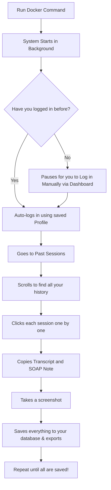

# 🏥 Heidi Health Scribe — Archival System

A simple, automated tool to save all your historical Heidi Health Scribe sessions (transcripts, SOAP notes, metadata, and screenshots) to your computer.

This guide is written so that **anyone**, regardless of technical background, can easily run the system using Docker as the primary method.

---

## 📊 How It Works

Here is a visual explanation of what this tool does when you run it:



---

## 🛠️ Step 1: Download & Setup

1. Open a new empty folder on your computer.
2. Open that folder in **VS Code**.
3. Open a new Terminal in VS Code and run:
   ```bash
   git clone https://github.com/SA-Medicine/Scibe_Session_Scapper.git
   ```
4. Move into the newly cloned folder:
   ```bash
   cd Scibe_Session_Scapper
   ```
5. **Configure your `.env` file:**
   - Find the file named `.env.example` in the project root.
   - Rename it to `.env` (just `.env`, no `.example`).
   - Open it and fill in your Heidi email and password. *(If you skip this, you can log in manually when the browser opens).*

---

## 🚀 Step 2: Run the System (Primary Method)

We use **Docker** as the main, fully-optimized run method to ensure everything works flawlessly on any machine. 

In your VS Code terminal, run the following commands to clear out any old data and start the system fresh:

```powershell
docker-compose rm -svf backend
docker volume rm heidi_session_archival_system_docker_chrome_profile
docker-compose up --build
```

- Watch the terminal. The tool will begin setting up the database, dashboard, and the headless browser.
- Once running, you can visit **`http://localhost:3000`** in your browser to view the Dashboard and live logs!

---

## 🔒 Step 3: Anonymize Database (Optional)

If you want to replace real patient data with fake, realistic data (PHI reduction) after the scraper finishes, run:

```powershell
docker-compose run --rm backend python main.py --anonymize-db
```

---

## 🔄 Step 4: Regular Updates

We frequently update the scraper to handle changes to the Heidi platform. To get the latest regular updates, simply open your VS Code terminal and run:

```bash
git pull
```
After pulling, restart the system using the commands in Step 2.

---

## 🧑‍💻 Developer / Fallback Method

**Run this only if Docker fails.**

The local batch script is primarily intended as a fallback or for developers testing local changes. The Docker method above is always the recommended and main run method.

If you must run it locally without Docker:
1. Ensure Python 3.11+ and Chrome are installed.
2. Run the script:
   ```powershell
   .\run_local.bat
   ```

---

## 📁 Where is My Saved Data?

Once the tool finishes, all your exported data is neatly organized:

- **Spreadsheets:** Look in the `backend/heidi_exporter/exports/` folder for `sessions.csv`, `transcripts.csv`, and `soap_notes.csv`.
- **Images:** Look in the `backend/heidi_exporter/screenshots/` folder for visual captures of every session.
- **Zip Files:** You will also get neatly packaged `.zip` files for every single session.

---

## ❓ FAQ & Troubleshooting

* **Docker container in use / Duplicate or Conflict error:**
  If you see an error about a container already being in use or a duplicate, either manually delete the conflicting container from the Docker Desktop app, or forcefully remove them by running this command in your terminal:
  `docker rm -f heidi_postgres heidi_backend heidi_dashboard`
  Then, always run the three commands in **Step 2** to restart.
* **The browser is stuck on the login page.**
  If automatic login fails, wait for the prompt to log in manually. Once logged in, the system will detect it and continue.
* **I need to start over completely.**
  Run the Docker cleanup commands from Step 2, and delete the `backend/heidi_exporter/checkpoints` folder.
