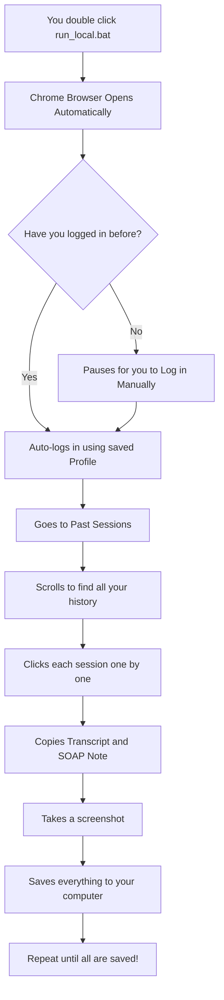
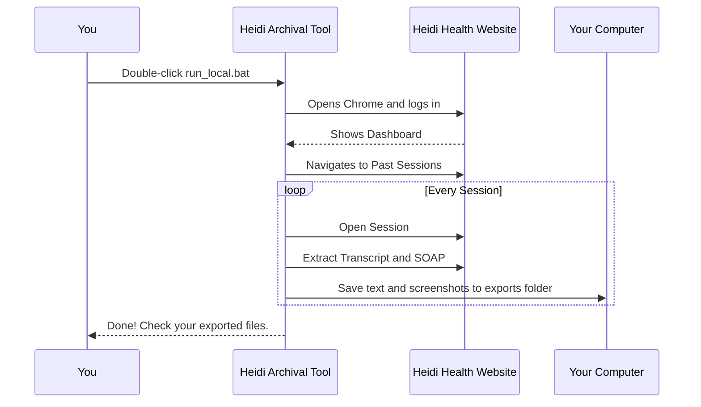

# 🏥 Heidi Health Scribe — Archival System

A simple, automated tool to save all your historical Heidi Health Scribe sessions (transcripts, SOAP notes, metadata, and screenshots) to your computer. 

This guide is written so that **anyone**, regardless of technical background, can easily run the system.

---

## 📊 How It Works

Here is a visual explanation of what this tool does when you run it:



---

## 🛠️ Step 1: What You Need (Prerequisites)

Before you begin, make sure you have these installed on your Windows computer:
1. **Google Chrome**: You probably already have this.
2. **Python**: The language this tool is built in.
   - Go to [Python.org Downloads](https://www.python.org/downloads/)
   - Click "Download Python 3.11 or newer".
   - **CRITICAL:** When running the Python installer, check the box that says **"Add Python.exe to PATH"** at the very bottom of the window before clicking Install. If you forget this, the tool won't run!

---

## 🚀 Step 2: How to Run the Tool

Follow these simple steps:

1. **Extract the Folder:** Make sure you have unzipped or downloaded this entire project folder to your Desktop or Documents.
2. **Add Your Credentials (Optional but Recommended):**
   - Inside the folder, look for a file called `.env.example`.
   - Rename it to `.env` (just `.env`, no `.example`).
   - Open it with Notepad and type in your Heidi email and password.
   - *Note: If you skip this, you can just log in manually when the browser opens.*
3. **Start the Tool:**
   - Double-click the file named **`run_local.bat`** (it might just show up as `run_local`).
   - A black text window will pop up, setting things up for you, followed by a new Google Chrome window.
4. **Watch it Work:**
   - The tool will take over the Chrome window. 
   - **Do not minimize or click inside the Chrome window** while it's working. Just let it navigate, click, and copy your notes automatically.

---

## 👤 Step 3: Running with a NEW Profile (Important!)

This tool is designed to save your login session in a "profile" folder so you don't have to log in every time (and to avoid annoying 2-Factor Authentication prompts over and over). 

**However, if you want to run this with a completely new profile and NOT use any built-in profile data (for example, switching accounts or starting completely fresh):**

You must delete the saved profile data to force a "New Profile" state.

1. Open the project folder.
2. Navigate into the `backend` folder, then into `heidi_exporter`.
3. **Delete** the following two folders if you see them:
   - `chrome_profile/` (This holds all Chrome history and login states)
   - `cookies/` (This holds login session cookies)
4. Now, double-click `run_local.bat` again. 
5. The tool will start with a completely fresh, brand-new Chrome profile without any previous data. It will pause and ask you to log in manually. Once you log in to the new account, press `Enter` in the black window, and it will save this *new* profile data for next time.

---

## 📁 Where is My Saved Data?

Once the tool finishes, all your exported data is neatly organized:

- **Spreadsheets:** Look in the `backend/heidi_exporter/exports/` folder for `sessions.csv`, `transcripts.csv`, and `soap_notes.csv`. You can open these in Excel.
- **Images:** Look in the `backend/heidi_exporter/screenshots/` folder for visual captures of every session.
- **Zip Files:** You will also get neatly packaged `.zip` files for every single session containing raw text and screenshots.



---

## 🐳 Advanced Usage: Docker & Command Line Flags

For technical users, the platform can be run entirely in Docker and controlled via command-line flags.

### Docker Step-by-Step
1. **Start the Database & Dashboard:**
   ```powershell
   docker-compose up -d postgres dashboard
   ```
2. **Access the Dashboard:**
   Visit `http://localhost:3000` in your browser.
3. **Run the Scraper (Headless Mode):**
   ```powershell
   docker-compose up backend
   ```
   *(You can watch the live logs from the dashboard's Live Scraper Console.)*
4. **Anonymize the Database (Docker):**
   If you want to replace real patient data with fake, realistic data (PHI reduction) after scraping:
   ```powershell
   docker-compose run --rm backend python main.py --anonymize-db
   ```
    ```powershell
    docker-compose up --build -d dashboard
    ```
 6. **Troubleshooting / Reset Chrome Profile:**
    If you ever encounter a `volume is in use` or browser crash error when running Docker, it usually means a background container is holding the browser profile lock. You can clear it and start fresh with:
    ```powershell
    docker-compose rm -svf backend
    docker volume rm heidi_session_archival_system_docker_chrome_profile
    ```

### Command Line Flags
If you run the script manually (e.g. inside `backend/heidi_exporter`), you can pass these flags to `main.py`:

**Scraper Flow Flags**
*   `--discover-only`: Only discover session metadata, without extracting transcripts or notes.
*   `--export-only`: Do not scrape; simply generate CSV/JSON exports from the existing database.
*   `--reset-archive`: **WARNING:** Clears the database tables and checkpoint, starting completely fresh.

**Anonymization Flags**
*   `--anonymize-db`: Replaces real names, phone numbers, emails, ages, etc. in the database with fake, realistic data (PHI reduction).
*   `--dry-run`: Use with `--anonymize-db` to print what *would* be changed without actually modifying the database.
*   `--anonymize-csvs`: Reads your exported CSV files and creates new `_anon.csv` versions with fake data.

---

## ❓ FAQ & Troubleshooting

*   **The black window disappears immediately!**
    *   You likely didn't install Python correctly. Re-run the Python installer, choose "Modify", and ensure "Add Python to environment variables/PATH" is checked.
*   **The browser is stuck on the login page.**
    *   Just log in manually! Once you see the Heidi dashboard, go back to the black window and press `Enter` to tell the tool to continue.
*   **I need to start over because it got stuck.**
    *   Close the black window and the Chrome window. Delete the `checkpoints` folder inside `backend/heidi_exporter/`, then double-click `run_local.bat` to try again.
